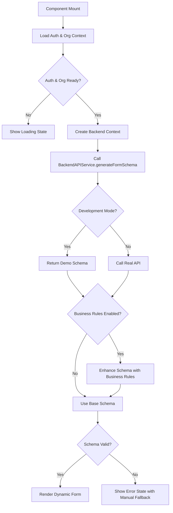

# Dynamic Form Schema Analysis: API Sources & Fallback Strategy
## DynamicProductCreationFormClean.tsx Schema Loading Investigation

### Executive Summary

The `DynamicProductCreationFormClean.tsx` component **does NOT have hardcoded fallback schemas**. It is designed to be **100% backend-dependent** for schema generation, with a **comprehensive fallback system** that prevents the component from breaking when the backend API is unavailable.

---

## Schema Source Analysis

### **Primary Schema Source: Backend API** 🌐

#### **API Endpoint Hit**
```typescript
// Line 174-189: Schema Loading Process
const { BackendAPIService, createBackendContext } = await import('@/lib/api/backendService');

// Creates organization-specific backend context
const backendContext = createBackendContext(
  stableContext.userId,           // From authentication context
  stableContext.organizationId,   // From organization context
  'BUSINESS_USER',               // Mapped user role
  stableContext.targetChannels,  // Organization's enabled channels
  stableContext.productCategory, // Organization's default category
  stableContext.permissions      // User's permissions
);

// Calls the main schema generation API
let result = await BackendAPIService.generateFormSchema(backendContext);
```

#### **Actual Backend API Call**
```typescript
// Production API Endpoint:
POST http://localhost:8888/labamap/api/v1/ecommerce/form-schema/generate

// Headers:
Authorization: Bearer {access_token}
X-Organization-ID: {organizationId}
X-User-ID: {userId}
Content-Type: application/json

// Request Body:
{
  "context": {
    "userId": "user_abc_456",
    "organizationId": "company_abc_12345", 
    "userRole": "BUSINESS_USER",
    "targetChannels": ["shopify", "amazon"],
    "productCategory": "electronics",
    "permissions": ["CREATE_PRODUCTS", "EDIT_PRODUCTS"],
    "requestId": "req_1736944234567",
    "timestamp": 1736944234567,
    "environment": "development"
  }
}
```

### **Development Mode: Demo Schema Generation** 🛠️

When `process.env.NODE_ENV === 'development'`, the backend service returns a **hardcoded demo schema** instead of making real API calls:

```typescript
// backendService.ts Lines 479-757: Demo Schema Generation
if (process.env.NODE_ENV === 'development') {
  console.log('[BackendAPIService] Development mode: Returning demo form schema');
  
  const demoSchema: DynamicFormSchema = {
    organizationId: context.organizationId,
    formId: `form_${Date.now()}`,
    version: "1.0.0",
    fields: [
      // 15+ predefined fields including:
      // - Basic fields: name, description, price, category, sku, inventory
      // - Conditional fields: size, color (clothing), warranty, storage (electronics)
      // - Variant configurator: hasVariants, variantConfigurator
    ]
  };
  
  return demoSchema;
}
```

### **Business Rules Schema Enhancement** ⚡

If organization has business rules enabled, the schema gets enhanced:

```typescript
// Lines 206-239: Business Rules Integration
if (businessRulesConfig?.businessRulesConfig?.globalSettings?.businessRulesEnabled) {
  const enhancedResult = await BackendAPIService.enhanceSchemaWithBusinessRules(
    parsedSchema,
    organization.organizationId,
    stableContext,
    enabledRules
  );
  
  if (enhancedResult?.enhancedSchema) {
    parsedSchema = enhancedResult.enhancedSchema;
  }
}
```

---

## Fallback Strategy Analysis

### **No Hardcoded Schema Fallbacks** ❌

The component **deliberately does not include hardcoded schema fallbacks**. Instead, it uses a **graceful degradation strategy**:

#### **Loading State** (Lines 818-828)
```typescript
if (isLoadingSchema) {
  return (
    <div className="max-w-4xl mx-auto p-6 flex items-center justify-center">
      <div className="text-center">
        <Loader2 className="h-8 w-8 animate-spin mx-auto mb-4" />
        <p className="text-gray-600">Loading form schema...</p>
      </div>
    </div>
  );
}
```

#### **Error State with Manual Fallback** (Lines 831-932)
```typescript
if (schemaError || !schema) {
  return (
    <div className="max-w-4xl mx-auto p-6">
      {/* Error Alert */}
      <Alert variant="destructive">
        <AlertDescription>
          {schemaError || 'Schema not loaded yet. Use the fallback form below to test product creation.'}
        </AlertDescription>
      </Alert>
      
      {/* Manual Retry Button */}
      <Button onClick={() => loadSchema()} disabled={isLoadingSchema}>
        Load Schema
      </Button>
      
      {/* Fallback Manual Form - NOT schema-driven */}
      <form onSubmit={(e) => { 
        e.preventDefault(); 
        const basicProductData = {
          name: 'Test Product ' + Date.now(),
          description: 'Test product created via manual fallback form',
          sku: `SKU-${Date.now()}`,
          price: 29.99,
          category: 'electronics',
          inventory: 10,
          status: 'draft'
        };
        handleSubmit(basicProductData);
      }}>
        <Button type="submit">🚀 CREATE TEST PRODUCT 🚀</Button>
      </form>
    </div>
  );
}
```

### **Why No Hardcoded Schema?** 🤔

**Design Philosophy**: The component is built for **true multi-tenancy** where each organization has unique:
- Field requirements
- Business rules
- Channel configurations
- Validation rules
- Workflow requirements

**Hardcoded schemas would:**
- ❌ Break multi-tenant isolation
- ❌ Force all organizations to use the same fields
- ❌ Prevent organization-specific business rules
- ❌ Create maintenance nightmares

---

## Schema Loading Flow

### **Complete Loading Sequence**



### **Critical Dependencies**

1. **Authentication Context** - Must provide valid user and organization data
2. **Organization Context** - Must provide business rules and configuration
3. **Backend API Service** - Must be reachable and functional
4. **Backend Context Creation** - Proper tenant isolation headers

### **Error Handling Strategy**

```typescript
// Lines 248-254: Comprehensive Error Handling
catch (error) {
  console.error('[DynamicProductCreationFormClean] ❌ Error in loadSchema:', error);
  const errorMessage = error instanceof Error ? error.message : 'Unknown error';
  setSchemaError(`Schema loading error: ${errorMessage}`);
  setIsLoadingSchema(false);
}
```

**Error Types Handled:**
- Network connectivity issues
- API authentication failures  
- Tenant isolation violations
- Malformed API responses
- Business rules loading failures

---

## Development vs Production Behavior

### **Development Mode** (LOCAL)
```typescript
// Uses hardcoded demo schema from backendService.ts
// No real API calls made
// Schema includes conditional fields for demo purposes
// Business rules return mock enhancements
```

**Demo Schema Features:**
- ✅ **15+ Fields**: Basic, conditional, and variant fields
- ✅ **Conditional Logic**: Size/color for clothing, warranty for electronics
- ✅ **Variant Support**: hasVariants + variantConfigurator fields
- ✅ **Business Rules Metadata**: Enhanced with mock business rules
- ✅ **Organization Context**: Uses real organization ID from context

### **Production Mode** (LIVE)
```typescript
// Makes real API calls to backend server
// Fully organization-specific schemas
// Real business rules execution
// Complete tenant isolation
```

**Production Schema Features:**
- ✅ **Organization-Specific**: Unique fields per organization
- ✅ **Channel-Aware**: Fields based on enabled sales channels
- ✅ **Business Rules**: Real-time rule execution and validation
- ✅ **Security**: Complete tenant isolation with validation

---

## API Endpoints Summary

### **Schema Generation APIs**
```bash
# Primary endpoint for schema generation
POST /api/v1/ecommerce/form-schema/generate
# Request: BackendContext with user/org data
# Response: DynamicFormSchema with organization-specific fields

# Schema enhancement with business rules  
POST /api/v1/ecommerce/form-schema/enhance-with-rules
# Request: Base schema + enabled business rules
# Response: Enhanced schema with business rules metadata
```

### **Business Rules APIs**
```bash
# Organization business rules configuration
GET /api/v1/organizations/{organizationId}/business-rules/configuration
# Response: Organization-specific business rules config

# Real-time business rules execution
POST /api/v1/ecommerce/business-rules/execute
# Request: Field data + rule type + context
# Response: Enhanced data + violations + suggestions

# Pre-submission business rules validation
POST /api/v1/ecommerce/business-rules/validate
# Request: Complete form data + target channels
# Response: Validation results + channel compatibility
```

### **Product Creation API**
```bash
# Product creation with enhanced data
POST /api/v1/ecommerce/dynamic-products/create
# Request: Form data + backend context
# Response: Created MasterProduct with tenant validation
```

---

## Tenant Isolation & Security

### **Tenant Validation in Every API Call**
```typescript
// All API calls include tenant headers
headers: {
  'Authorization': `Bearer ${accessToken}`,
  'X-Organization-ID': context.organizationId,
  'X-User-ID': context.userId,
  'X-User-Role': context.userRole
}

// Response validation prevents data leakage
if (data.organizationId !== context.organizationId) {
  throw new TenantIsolationError('Organization data mismatch - security violation');
}
```

### **Context-Driven Schema Generation**
```typescript
// Schema depends on organization-specific context
const stableContext = {
  userId: user.userId,                    // From auth
  organizationId: organization.organizationId, // From org context
  targetChannels: getAssignedChannels(),  // Org-specific channels
  productCategory: getDefaultCategory(),  // Org-specific category
  permissions: userPermissions.map(p => p.name) // User-specific
};
```

---

## Conclusion

### **Schema Source: 100% Backend-Driven** ✅

The `DynamicProductCreationFormClean.tsx` component:
- ✅ **NO hardcoded schemas** - All schemas come from backend APIs
- ✅ **Development fallback** - Uses demo schema during development
- ✅ **Error resilience** - Provides manual product creation when schema fails
- ✅ **Multi-tenant ready** - Fully organization-aware schema generation
- ✅ **Business rules integration** - Enhanced schemas with real-time rules
- ✅ **Security-first** - Complete tenant isolation validation

### **API Dependency Chain**
1. **Authentication Context** → User & Organization data
2. **Backend Context Creation** → Tenant-specific API context
3. **Schema Generation API** → Organization-specific form schema
4. **Business Rules Enhancement** → Schema enhanced with business rules
5. **Real-time Field Processing** → Business rules during data entry
6. **Product Creation API** → Final product creation with validation

### **Fallback Strategy: Graceful Degradation** 📉
- **Primary**: Dynamic schema from backend API
- **Development**: Hardcoded demo schema in backend service
- **Failure**: Manual product creation form (non-schema-driven)
- **Error Recovery**: Manual schema reload capability

The component exemplifies **modern multi-tenant SaaS architecture** where schemas are completely dynamic, organization-specific, and business-rules-driven, with **zero hardcoded fallbacks** that could compromise tenant isolation or business requirements.

---

# Automated Channel Schema Discovery & Payload Structure Integration

## The Challenge: Dynamic Channel Integration

As an omnichannel platform developer, manually defining payload structures for each channel is unsustainable. You need **automated schema discovery** that can:

1. **Discover** channel-specific payload requirements
2. **Parse** API documentation and schemas
3. **Generate** transformation configurations
4. **Update** automatically when channels change their APIs

## Modern Solutions for Automated Schema Discovery

### **1. OpenAPI/Swagger Schema Harvesting**

Most modern marketplaces provide OpenAPI specifications. You can automate schema extraction:

```typescript
class ChannelSchemaHarvester {
  async discoverChannelSchema(channelConfig: ChannelConfig): Promise<ChannelSchema> {
    // Step 1: Fetch OpenAPI specification
    const openApiSpec = await this.fetchOpenApiSpec(channelConfig.apiDocsUrl);
    
    // Step 2: Extract product creation/update endpoints
    const productEndpoints = this.extractProductEndpoints(openApiSpec);
    
    // Step 3: Parse payload schemas
    const payloadSchema = this.parsePayloadSchema(productEndpoints);
    
    // Step 4: Generate field mappings
    const fieldMappings = await this.generateFieldMappings(payloadSchema);
    
    return {
      channelId: channelConfig.id,
      apiVersion: openApiSpec.info.version,
      lastUpdated: new Date(),
      schema: payloadSchema,
      fieldMappings,
      validationRules: this.extractValidationRules(payloadSchema)
    };
  }
  
  private async fetchOpenApiSpec(apiDocsUrl: string): Promise<OpenAPISchema> {
    // Common OpenAPI URLs for major platforms
    const platformUrls = {
      'shopify': 'https://shopify.dev/docs/api/admin-rest/2024-01/openapi.json',
      'amazon': 'https://developer-docs.amazon.com/sp-api/docs/feeds-api-v2021-06-30-reference',
      'ebay': 'https://developer.ebay.com/api-docs/commerce/catalog/static/overview.html',
      'walmart': 'https://developer.walmart.com/api/us/mp/items'
    };
    
    const response = await fetch(apiDocsUrl);
    return await response.json();
  }
  
  private extractProductEndpoints(spec: OpenAPISchema): ProductEndpoint[] {
    const endpoints = [];
    
    // Look for product-related endpoints
    for (const [path, methods] of Object.entries(spec.paths)) {
      if (this.isProductEndpoint(path)) {
        for (const [method, operation] of Object.entries(methods)) {
          if (['post', 'put', 'patch'].includes(method.toLowerCase())) {
            endpoints.push({
              path,
              method: method.toUpperCase(),
              requestSchema: operation.requestBody?.content?.['application/json']?.schema,
              responseSchema: operation.responses?.['200']?.content?.['application/json']?.schema
            });
          }
        }
      }
    }
    
    return endpoints;
  }
  
  private isProductEndpoint(path: string): boolean {
    const productPatterns = [
      /\/products?/i,
      /\/items?/i,
      /\/listings?/i,
      /\/catalog/i,
      /\/inventory/i
    ];
    
    return productPatterns.some(pattern => pattern.test(path));
  }
}
```

### **2. GraphQL Schema Introspection**

For GraphQL-based marketplaces, use introspection queries:

```typescript
class GraphQLSchemaDiscovery {
  async introspectChannelSchema(endpoint: string): Promise<GraphQLChannelSchema> {
    const introspectionQuery = `
      query IntrospectionQuery {
        __schema {
          types {
            name
            kind
            fields {
              name
              type {
                name
                kind
                ofType {
                  name
                  kind
                }
              }
            }
          }
          mutationType {
            fields {
              name
              args {
                name
                type {
                  name
                  kind
                }
              }
            }
          }
        }
      }
    `;
    
    const response = await fetch(endpoint, {
      method: 'POST',
      headers: { 'Content-Type': 'application/json' },
      body: JSON.stringify({ query: introspectionQuery })
    });
    
    const schema = await response.json();
    return this.parseGraphQLSchema(schema.data.__schema);
  }
  
  private parseGraphQLSchema(schema: any): GraphQLChannelSchema {
    // Find product-related types
    const productTypes = schema.types.filter(type => 
      ['Product', 'Item', 'Listing', 'Variant'].some(keyword => 
        type.name.includes(keyword)
      )
    );
    
    // Find product mutations
    const productMutations = schema.mutationType?.fields?.filter(field =>
      ['create', 'update', 'upsert'].some(action => 
        field.name.toLowerCase().includes(action)
      ) && ['product', 'item', 'listing'].some(entity =>
        field.name.toLowerCase().includes(entity)
      )
    );
    
    return {
      productTypes,
      mutations: productMutations,
      fieldMappings: this.generateGraphQLMappings(productTypes)
    };
  }
}
```

### **3. AI-Powered Documentation Parsing**

For channels without structured schemas, use AI to parse documentation:

```typescript
class AIDocumentationParser {
  constructor(private aiService: AIService) {}
  
  async parseChannelDocumentation(channelId: string): Promise<ChannelSchema> {
    // Step 1: Scrape API documentation
    const documentation = await this.scrapeApiDocs(channelId);
    
    // Step 2: Use AI to extract schema information
    const prompt = `
      Analyze this API documentation and extract the product payload structure:
      
      Documentation: ${documentation}
      
      Please provide:
      1. Required fields for product creation/update
      2. Field types and constraints
      3. Nested object structures
      4. Validation rules
      5. Example payload structure
      
      Format the response as a JSON schema.
    `;
    
    const aiResponse = await this.aiService.analyzeDocumentation(prompt);
    
    // Step 3: Validate and structure the response
    return this.validateAndParseAIResponse(aiResponse, channelId);
  }
  
  private async scrapeApiDocs(channelId: string): Promise<string> {
    const docUrls = {
      'tiktok-shop': 'https://partner.tiktokshop.com/docv2/page/6507ead7b99d5302be949ba9',
      'facebook-commerce': 'https://developers.facebook.com/docs/commerce-platform/catalog',
      'pinterest-business': 'https://developers.pinterest.com/docs/api/v5/#operation/items/create',
      'google-merchant': 'https://developers.google.com/shopping-content/reference/rest/v2.1/products'
    };
    
    const url = docUrls[channelId];
    if (!url) throw new Error(`No documentation URL found for ${channelId}`);
    
    // Use web scraping or API documentation services
    return await this.webScraper.extractContent(url);
  }
}
```

### **4. Runtime Schema Learning**

Learn payload structures from successful API calls:

```typescript
class RuntimeSchemaLearner {
  private schemaDatabase = new Map<string, LearnedSchema>();
  
  async learnFromSuccessfulCall(
    channelId: string, 
    payload: any, 
    response: ApiResponse
  ): Promise<void> {
    if (response.success) {
      const existingSchema = this.schemaDatabase.get(channelId) || {
        fields: new Map(),
        examples: [],
        confidence: 0
      };
      
      // Analyze the successful payload structure
      this.analyzePayloadStructure(payload, existingSchema);
      
      // Update confidence based on successful calls
      existingSchema.confidence = Math.min(
        existingSchema.confidence + 0.1, 
        1.0
      );
      
      existingSchema.examples.push({
        payload,
        timestamp: new Date(),
        success: true
      });
      
      this.schemaDatabase.set(channelId, existingSchema);
      
      // Auto-generate schema when confidence is high enough
      if (existingSchema.confidence > 0.8) {
        await this.generateSchemaFromLearning(channelId, existingSchema);
      }
    }
  }
  
  private analyzePayloadStructure(payload: any, schema: LearnedSchema): void {
    const flattenedFields = this.flattenObject(payload);
    
    for (const [fieldPath, value] of Object.entries(flattenedFields)) {
      const fieldInfo = schema.fields.get(fieldPath) || {
        type: this.inferType(value),
        required: false,
        examples: [],
        frequency: 0
      };
      
      fieldInfo.frequency++;
      fieldInfo.examples.push(value);
      
      // Field is likely required if it appears in most successful calls
      if (fieldInfo.frequency / schema.examples.length > 0.8) {
        fieldInfo.required = true;
      }
      
      schema.fields.set(fieldPath, fieldInfo);
    }
  }
}
```

## **Automated Transformation Configuration Generation**

Once you have the schema, automatically generate transformation configs:

```typescript
class TransformationConfigGenerator {
  async generateConfig(
    channelSchema: ChannelSchema,
    masterSchema: MasterProductSchema
  ): Promise<ChannelTransformationConfig> {
    
    // Step 1: Automatic field matching using semantic similarity
    const fieldMappings = await this.generateFieldMappings(
      masterSchema.fields,
      channelSchema.fields
    );
    
    // Step 2: Generate validation rules from channel constraints
    const validationRules = this.generateValidationRules(channelSchema);
    
    // Step 3: Create default transformation templates
    const transformationTemplates = await this.generateTransformationTemplates(
      fieldMappings,
      channelSchema
    );
    
    return {
      channelId: channelSchema.channelId,
      version: channelSchema.apiVersion,
      fieldMappings,
      validationRules,
      transformationTemplates,
      generatedAt: new Date(),
      confidence: this.calculateConfigConfidence(fieldMappings)
    };
  }
  
  private async generateFieldMappings(
    masterFields: MasterField[],
    channelFields: ChannelField[]
  ): Promise<FieldMapping[]> {
    const mappings: FieldMapping[] = [];
    
    for (const channelField of channelFields) {
      // Use semantic similarity to find best match
      const bestMatch = await this.findBestFieldMatch(
        channelField,
        masterFields
      );
      
      if (bestMatch.confidence > 0.7) {
        mappings.push({
          source: bestMatch.masterField.path,
          target: channelField.path,
          transformation: this.inferTransformation(
            bestMatch.masterField,
            channelField
          ),
          confidence: bestMatch.confidence
        });
      } else {
        // No good match found - flag for manual review
        mappings.push({
          source: null,
          target: channelField.path,
          transformation: { type: 'manual_review_required' },
          confidence: 0,
          requiresManualMapping: true
        });
      }
    }
    
    return mappings;
  }
  
  private async findBestFieldMatch(
    channelField: ChannelField,
    masterFields: MasterField[]
  ): Promise<FieldMatchResult> {
    const similarities = await Promise.all(
      masterFields.map(async masterField => ({
        masterField,
        similarity: await this.calculateSemanticSimilarity(
          channelField.name,
          masterField.name,
          channelField.description,
          masterField.description
        )
      }))
    );
    
    const bestMatch = similarities.reduce((best, current) => 
      current.similarity > best.similarity ? current : best
    );
    
    return {
      masterField: bestMatch.masterField,
      confidence: bestMatch.similarity
    };
  }
  
  private async calculateSemanticSimilarity(
    name1: string,
    name2: string,
    desc1?: string,
    desc2?: string
  ): Promise<number> {
    // Use AI embeddings for semantic similarity
    const text1 = `${name1} ${desc1 || ''}`.trim();
    const text2 = `${name2} ${desc2 || ''}`.trim();
    
    const [embedding1, embedding2] = await Promise.all([
      this.aiService.getEmbedding(text1),
      this.aiService.getEmbedding(text2)
    ]);
    
    return this.cosineSimilarity(embedding1, embedding2);
  }
}
```

## **Real-World Implementation Example**

Here's how to build a complete automated schema discovery system:

```typescript
class AutomatedChannelIntegration {
  private schemaHarvester = new ChannelSchemaHarvester();
  private configGenerator = new TransformationConfigGenerator();
  private schemaUpdater = new SchemaUpdateMonitor();
  
  async integrateNewChannel(channelConfig: NewChannelConfig): Promise<IntegrationResult> {
    try {
      console.log(`🔍 Discovering schema for ${channelConfig.id}...`);
      
      // Step 1: Discover channel schema automatically
      const channelSchema = await this.discoverChannelSchema(channelConfig);
      
      console.log(`📋 Found ${channelSchema.fields.length} fields`);
      
      // Step 2: Generate transformation configuration
      const transformConfig = await this.configGenerator.generateConfig(
        channelSchema,
        this.masterProductSchema
      );
      
      console.log(`🔧 Generated ${transformConfig.fieldMappings.length} field mappings`);
      
      // Step 3: Validate configuration with test data
      const validationResult = await this.validateConfiguration(
        transformConfig,
        this.getTestProducts()
      );
      
      console.log(`✅ Validation: ${validationResult.successRate}% success rate`);
      
      // Step 4: Deploy configuration if validation passes
      if (validationResult.successRate > 0.8) {
        await this.deployChannelConfig(channelConfig.id, transformConfig);
        
        // Step 5: Set up monitoring for schema changes
        await this.schemaUpdater.monitorChannel(channelConfig.id, channelSchema);
        
        return {
          success: true,
          channelId: channelConfig.id,
          automatedFields: transformConfig.fieldMappings.filter(m => !m.requiresManualMapping).length,
          manualReviewRequired: transformConfig.fieldMappings.filter(m => m.requiresManualMapping).length,
          message: `Channel ${channelConfig.id} integrated successfully with ${validationResult.successRate}% automation`
        };
      } else {
        return {
          success: false,
          message: `Validation failed: ${validationResult.issues.join(', ')}`
        };
      }
      
    } catch (error) {
      console.error(`❌ Failed to integrate ${channelConfig.id}:`, error);
      return {
        success: false,
        message: `Integration failed: ${error.message}`
      };
    }
  }
  
  private async discoverChannelSchema(config: NewChannelConfig): Promise<ChannelSchema> {
    // Try multiple discovery methods
    const discoveryMethods = [
      () => this.tryOpenApiDiscovery(config),
      () => this.tryGraphQLIntrospection(config),
      () => this.tryAIDocumentationParsing(config),
      () => this.tryRuntimeLearning(config)
    ];
    
    for (const method of discoveryMethods) {
      try {
        const schema = await method();
        if (schema && schema.fields.length > 0) {
          console.log(`✅ Schema discovered using ${method.name}`);
          return schema;
        }
      } catch (error) {
        console.log(`⚠️ ${method.name} failed: ${error.message}`);
      }
    }
    
    throw new Error(`Could not discover schema for ${config.id} using any method`);
  }
}
```

## **Monitoring & Auto-Updates**

Keep schemas synchronized with channel changes:

```typescript
class SchemaUpdateMonitor {
  private watchers = new Map<string, SchemaWatcher>();
  
  async monitorChannel(channelId: string, currentSchema: ChannelSchema): Promise<void> {
    const watcher = new SchemaWatcher(channelId, currentSchema);
    
    // Check for updates daily
    watcher.schedule('0 0 * * *', async () => {
      const latestSchema = await this.schemaHarvester.discoverChannelSchema({
        id: channelId,
        ...this.getChannelConfig(channelId)
      });
      
      const changes = this.compareSchemas(currentSchema, latestSchema);
      
      if (changes.hasBreakingChanges) {
        await this.handleBreakingChanges(channelId, changes);
      } else if (changes.hasAdditions) {
        await this.handleNewFields(channelId, changes.newFields);
      }
    });
    
    this.watchers.set(channelId, watcher);
  }
  
  private async handleBreakingChanges(
    channelId: string, 
    changes: SchemaChanges
  ): Promise<void> {
    // Notify developers about breaking changes
    await this.notificationService.sendAlert({
      type: 'breaking_changes',
      channelId,
      changes: changes.breakingChanges,
      severity: 'high',
      action: 'Update transformation config within 7 days'
    });
    
    // Attempt automatic migration
    const migrationResult = await this.attemptAutoMigration(channelId, changes);
    
    if (!migrationResult.success) {
      // Fall back to manual intervention
      await this.createMigrationTask(channelId, changes);
    }
  }
  
  private async handleNewFields(
    channelId: string, 
    newFields: ChannelField[]
  ): Promise<void> {
    // Automatically try to map new fields
    const autoMappings = await this.configGenerator.generateFieldMappings(
      this.masterProductSchema.fields,
      newFields
    );
    
    const highConfidenceMappings = autoMappings.filter(m => m.confidence > 0.8);
    
    if (highConfidenceMappings.length > 0) {
      // Auto-deploy high confidence mappings
      await this.deployFieldMappings(channelId, highConfidenceMappings);
      
      // Notify about successful auto-mapping
      await this.notificationService.sendInfo({
        type: 'auto_mapping_success',
        channelId,
        newFields: highConfidenceMappings.length,
        message: `Automatically mapped ${highConfidenceMappings.length} new fields`
      });
    }
    
    // Flag low confidence mappings for manual review
    const manualReviewFields = autoMappings.filter(m => m.confidence <= 0.8);
    if (manualReviewFields.length > 0) {
      await this.createReviewTask(channelId, manualReviewFields);
    }
  }
}
```

## **Integration with Your Current System**

Here's how to integrate this with your existing payload construction:

```typescript
// Enhanced version of your current ChannelSync.tsx
class EnhancedChannelSync {
  private automatedChannels = new AutomatedChannelIntegration();
  
  async syncProduct(productId: string, channelId: string): Promise<SyncResult> {
    // Check if we have automated configuration for this channel
    const channelConfig = await this.getChannelConfig(channelId);
    
    if (channelConfig.isAutomated) {
      // Use automated transformation
      return await this.automatedSync(productId, channelId, channelConfig);
    } else {
      // Fall back to manual/template approach
      return await this.manualSync(productId, channelId);
    }
  }
  
  private async automatedSync(
    productId: string, 
    channelId: string, 
    config: AutomatedChannelConfig
  ): Promise<SyncResult> {
    const masterData = await this.getMasterProduct(productId);
    
    // Apply automated transformation
    const payload = await this.transformationEngine.transform(
      masterData,
      config.transformationConfig
    );
    
    // Validate against learned schema
    const validation = await this.validatePayload(payload, config.schema);
    
    if (validation.isValid) {
      return await this.sendToChannel(channelId, payload);
    } else {
      // Log validation issues for schema improvement
      await this.logValidationIssues(channelId, validation.issues);
      throw new Error(`Payload validation failed: ${validation.issues.join(', ')}`);
    }
  }
}
```

## **Key Takeaways**

### **1. Multi-Method Discovery**
- Try OpenAPI/Swagger first (most reliable)
- Fall back to GraphQL introspection
- Use AI for unstructured documentation
- Learn from runtime success patterns

### **2. Continuous Learning**
- Monitor API changes automatically
- Update configurations based on successful calls
- Flag breaking changes for manual review
- Auto-deploy high-confidence mappings

### **3. Validation & Confidence**
- Always validate generated configurations
- Use confidence scores for automation decisions
- Maintain fallback mechanisms
- Log everything for improvement

### **4. Human-in-the-Loop**
- Auto-handle high-confidence mappings (>80%)
- Flag medium-confidence for review (50-80%)
- Require manual mapping for low-confidence (<50%)

This approach enables **true scalability** - you can integrate new channels in hours instead of weeks, and the system continuously improves its automation capabilities.