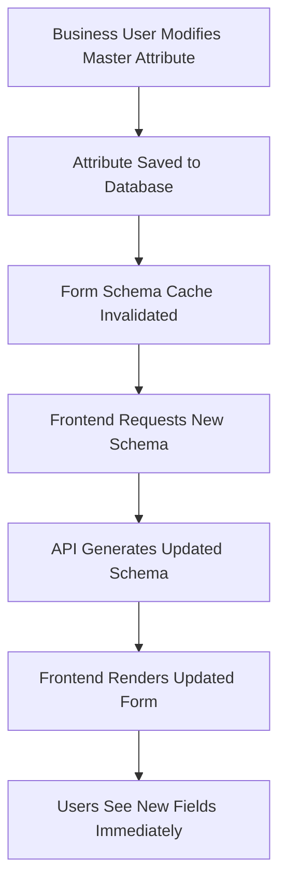

# 🎯 Business User Rule Management: Intersection, Conflicts, and Governance

## 📋 Overview: Business User Empowerment in Rule Creation

After analyzing `master-attributes-comprehensive.json` and `business-rules-registry.json`, this document addresses critical challenges business users face when managing rules in an omnichannel ecommerce platform:

1. **How extensively are business users involved in rule creation?**
2. **What happens when rules intersect or conflict with each other?**
3. **How do we manage complex rule dependencies for business users?**
4. **What governance frameworks enable business autonomy while preventing chaos?**

---

## 🔍 Analysis: Business User Involvement Levels

### **📊 Current Rule Ownership Matrix**

Based on the JSON configurations, here's the business user involvement breakdown:

| **Rule Type** | **Business Control** | **Configuration Location** | **Business User Tasks** |
|---------------|---------------------|---------------------------|-------------------------|
| **Field Definitions** | 95% | `master-attributes-comprehensive.json` | ✅ Define validation rules, priorities, channel support |
| **Pre-Processing Rules** | 85% | `business-rules-registry.json` | ✅ Configure patterns, formatting, normalization logic |
| **Business Logic Rules** | 95% | `business-rules-registry.json` | ✅ Set pricing limits, inventory rules, validation criteria |
| **Data Enhancement Rules** | 70% | `business-rules-registry.json` | ✅ Configure SEO formats, image requirements, descriptions |

### **🎯 High Business User Involvement Areas**

#### **1. Field-Level Rule Configuration**
```json
// From master-attributes-comprehensive.json - Business users control:
{
  "fieldName": "price",
  "validationRules": {
    "min": 0.01,           // Business decision
    "max": 999999.99,      // Business policy
    "precision": 2         // Business requirement
  },
  "ruleReferences": {
    "preProcessing": ["PRICE_NORMALIZATION"],     // Business choice
    "businessLogic": ["PRICE_VALIDATION"],        // Business policy
    "dataEnhancement": ["PRICE_FORMATTING"]       // Business preference
  },
  "priority": 1,           // Business priority
  "supportedChannels": ["amazon", "shopify", "walmart"] // Business strategy
}
```

#### **2. Business Logic Rule Configuration**
```json
// From business-rules-registry.json - Business users define:
{
  "ruleId": "PRICE_VALIDATION",
  "configuration": {
    "categoryLimits": {
      "electronics": {"minPrice": 1.0, "maxPrice": 50000.0},    // Business policy
      "clothing": {"minPrice": 5.0, "maxPrice": 2000.0},       // Business decision
      "jewelry": {"minPrice": 10.0, "maxPrice": 100000.0}      // Business strategy
    },
    "channelRules": {
      "amazon": {"minPrice": 1.0, "requiresGTIN": false},      // Business choice
      "walmart": {"minPrice": 0.50, "requiresGTIN": true}      // Business requirement
    }
  }
}
```

---

## ⚠️ Rule Intersection Challenges: The Real Problem

### **🚨 Scenario 1: Conflicting Price Rules**

**The Problem**: Multiple rules affecting the same field with different requirements

```json
// Rule 1: PRICE_NORMALIZATION (Pre-processing)
{
  "ruleId": "PRICE_NORMALIZATION",
  "configuration": {
    "precision": 2,
    "roundingMode": "HALF_UP"
  }
}

// Rule 2: PRICE_VALIDATION (Business Logic)  
{
  "ruleId": "PRICE_VALIDATION",
  "configuration": {
    "categoryLimits": {
      "electronics": {"minPrice": 1.0}
    }
  }
}

// Rule 3: PRICE_FORMATTING (Data Enhancement)
{
  "ruleId": "PRICE_FORMATTING", 
  "configuration": {
    "channelSpecific": {
      "walmart": {"roundToCents": true, "noDecimals": false}
    }
  }
}
```

**Intersection Conflicts**:
- Price normalized to 2 decimals, but Walmart formatting says "noDecimals": false
- What if normalized price falls below category minimum after rounding?
- Which rule takes precedence when they contradict?

### **🚨 Scenario 2: Channel vs Category Rule Conflicts**

```json
// Channel requirement from master-attributes
{
  "fieldName": "gtin",
  "supportedChannels": ["amazon", "walmart", "google", "facebook"],
  "required": false  // Master attribute says optional
}

// But channel-specific business rule says:
{
  "ruleId": "REQUIRED_FIELDS_VALIDATION",
  "configuration": {
    "channelRequirements": {
      "walmart": {
        "requiredFields": ["name", "price", "brand", "gtin"]  // Walmart requires GTIN
      }
    }
  }
}
```

**The Conflict**: Master attribute says GTIN is optional, but business rule for Walmart channel says it's required.

### **🚨 Scenario 3: Field Priority vs Rule Priority Conflicts**

```json
// Master attribute priority
{
  "fieldName": "name",
  "priority": 1,  // High priority field
  "ruleReferences": {
    "preProcessing": ["NAME_NORMALIZATION"]
  }
}

// But the rule has different priority
{
  "ruleId": "NAME_NORMALIZATION",
  "priority": 90  // Lower priority rule
}
```

**The Question**: Should field priority or rule priority determine execution order when they conflict?

---

## 🛠️ Solution Framework: Intelligent Rule Management

### **1. Rule Precedence Hierarchy**

```yaml
# Proposed rule precedence framework for business users
rule_precedence_framework:
  level_1_critical:
    - legal_compliance_rules     # Cannot be overridden
    - platform_api_limits       # Technical constraints
    - payment_gateway_rules      # Financial security
    
  level_2_business_policy:
    - category_business_rules    # Business logic validation
    - pricing_strategy_rules     # Business pricing policies
    - inventory_management_rules # Business operations
    
  level_3_channel_optimization:
    - channel_transformation_rules  # Channel-specific formatting
    - seo_enhancement_rules         # Marketing optimization
    - content_formatting_rules     # Presentation rules
    
  level_4_data_quality:
    - normalization_rules        # Data cleanup
    - formatting_rules           # Consistency rules
    - enhancement_rules          # Data enrichment

execution_order: "level_1 → level_2 → level_3 → level_4"
conflict_resolution: "higher_level_always_wins"
```

### **2. Smart Rule Intersection Detection**

```java
// Business-friendly rule conflict detection
@Service
public class BusinessRuleConflictDetector {
    
    public ConflictAnalysisReport analyzeRuleIntersections(String fieldName, List<String> ruleIds) {
        
        ConflictAnalysisReport report = new ConflictAnalysisReport();
        
        // Group rules by type and precedence level
        Map<RulePrecedenceLevel, List<BusinessRule>> rulesByLevel = groupRulesByPrecedence(ruleIds);
        
        // Check for direct conflicts
        List<RuleConflict> directConflicts = detectDirectConflicts(fieldName, rulesByLevel);
        
        // Check for logical conflicts
        List<RuleConflict> logicalConflicts = detectLogicalConflicts(fieldName, rulesByLevel);
        
        // Check for performance conflicts
        List<RuleConflict> performanceConflicts = detectPerformanceIssues(rulesByLevel);
        
        // Generate business-friendly recommendations
        List<ConflictResolution> recommendations = generateResolutions(
            directConflicts, logicalConflicts, performanceConflicts
        );
        
        return report.builder()
            .fieldName(fieldName)
            .totalRulesAnalyzed(ruleIds.size())
            .conflictsFound(directConflicts.size() + logicalConflicts.size())
            .directConflicts(directConflicts)
            .logicalConflicts(logicalConflicts) 
            .performanceWarnings(performanceConflicts)
            .recommendedActions(recommendations)
            .businessImpactAssessment(assessBusinessImpact(directConflicts))
            .build();
    }
    
    private List<RuleConflict> detectDirectConflicts(String fieldName, 
                                                    Map<RulePrecedenceLevel, List<BusinessRule>> rulesByLevel) {
        
        List<RuleConflict> conflicts = new ArrayList<>();
        
        // Example: Detect price precision conflicts
        if ("price".equals(fieldName)) {
            
            Optional<Integer> normalizationPrecision = findPrecisionInRules(rulesByLevel, "PRICE_NORMALIZATION");
            Optional<Boolean> formattingNoDecimals = findNoDecimalsInRules(rulesByLevel, "PRICE_FORMATTING");
            
            if (normalizationPrecision.isPresent() && formattingNoDecimals.isPresent()) {
                if (normalizationPrecision.get() > 0 && formattingNoDecimals.get()) {
                    conflicts.add(RuleConflict.builder()
                        .conflictType("PRECISION_FORMATTING_MISMATCH")
                        .severity(ConflictSeverity.HIGH)
                        .description("Price normalization sets 2 decimal places, but formatting rule removes decimals")
                        .businessImpact("Prices may display incorrectly to customers")
                        .affectedRules(Arrays.asList("PRICE_NORMALIZATION", "PRICE_FORMATTING"))
                        .recommendedAction("Align precision settings or use conditional formatting")
                        .build());
                }
            }
        }
        
        return conflicts;
    }
}
```

### **3. Business User Rule Management Interface**

```java
@RestController
@RequestMapping("/admin/business-rules")
@PreAuthorize("hasRole('BUSINESS_USER')")
public class BusinessRuleManagementController {
    
    /**
     * Analyze rule conflicts before applying changes
     */
    @PostMapping("/analyze-conflicts")
    public ResponseEntity<ConflictAnalysisReport> analyzeRuleConflicts(
            @RequestBody RuleConflictAnalysisRequest request) {
        
        ConflictAnalysisReport report = ruleConflictDetector.analyzeRuleIntersections(
            request.getFieldName(), 
            request.getRuleIds()
        );
        
        return ResponseEntity.ok(report);
    }
    
    /**
     * Simulate rule execution to preview results
     */
    @PostMapping("/simulate-execution")
    public ResponseEntity<RuleSimulationResult> simulateRuleExecution(
            @RequestBody RuleSimulationRequest request) {
        
        // Test rules against sample data without persisting changes
        RuleSimulationResult result = ruleSimulationService.simulateRules(
            request.getSampleData(),
            request.getRuleConfiguration(),
            request.getTargetChannels()
        );
        
        return ResponseEntity.ok(result);
    }
    
    /**
     * Get rule dependency map for visual management
     */
    @GetMapping("/dependency-map/{fieldName}")
    public ResponseEntity<RuleDependencyMap> getRuleDependencyMap(@PathVariable String fieldName) {
        
        RuleDependencyMap dependencyMap = ruleDependencyAnalyzer.analyzeDependencies(fieldName);
        
        return ResponseEntity.ok(dependencyMap);
    }
    
    /**
     * Apply rule changes with automatic conflict resolution
     */
    @PutMapping("/apply-with-resolution")
    public ResponseEntity<RuleApplicationResult> applyRulesWithConflictResolution(
            @RequestBody RuleApplicationRequest request) {
        
        // Step 1: Analyze conflicts
        ConflictAnalysisReport conflicts = ruleConflictDetector.analyzeRuleIntersections(
            request.getFieldName(), 
            request.getRuleIds()
        );
        
        // Step 2: Apply automatic resolution if possible
        if (conflicts.hasAutoResolvableConflicts()) {
            RuleConfiguration resolvedConfig = conflictResolver.autoResolveConflicts(
                request.getRuleConfiguration(), 
                conflicts
            );
            request.setRuleConfiguration(resolvedConfig);
        }
        
        // Step 3: Apply rules
        RuleApplicationResult result = businessRuleService.applyRuleChanges(request);
        
        // Step 4: Include conflict information in response
        result.setConflictAnalysis(conflicts);
        
        return ResponseEntity.ok(result);
    }
}
```

---

## 🎯 Governance Framework: Preventing Rule Chaos

### **1. Rule Validation Gates**

```yaml
# Business rule validation framework
business_rule_validation_gates:
  
  gate_1_syntax_validation:
    checks:
      - valid_json_configuration
      - required_fields_present
      - data_type_compliance
      - enum_value_validation
    auto_fix: true
    
  gate_2_logical_validation:
    checks:
      - field_compatibility_check
      - channel_support_validation
      - category_applicability_check
      - priority_range_validation
    auto_fix: false
    
  gate_3_conflict_detection:
    checks:
      - rule_intersection_analysis
      - precedence_conflict_detection
      - performance_impact_assessment
      - business_logic_coherence
    auto_fix: "suggest_only"
    
  gate_4_business_impact:
    checks:
      - regulatory_compliance_check
      - revenue_impact_assessment
      - customer_experience_impact
      - operational_feasibility
    auto_fix: false
    require_approval: true

validation_workflow: "gate_1 → gate_2 → gate_3 → gate_4"
failure_action: "block_with_detailed_feedback"
```

### **2. Rule Change Management Process**

```java
@Service
public class BusinessRuleChangeManagementService {
    
    public RuleChangeResult processRuleChange(RuleChangeRequest request) {
        
        // Step 1: Validation gates
        ValidationResult validation = validateRuleChange(request);
        if (!validation.isValid()) {
            return RuleChangeResult.rejected(validation.getErrors());
        }
        
        // Step 2: Impact analysis
        BusinessImpactAssessment impact = assessBusinessImpact(request);
        
        // Step 3: Approval workflow (if required)
        if (impact.requiresApproval()) {
            ApprovalRequest approval = createApprovalRequest(request, impact);
            return RuleChangeResult.pendingApproval(approval);
        }
        
        // Step 4: Staged deployment
        StagedDeploymentResult deployment = deployRuleChanges(request);
        
        // Step 5: Monitoring and rollback capability
        monitoringService.setupRuleChangeMonitoring(deployment.getDeploymentId());
        
        return RuleChangeResult.success(deployment);
    }
    
    private BusinessImpactAssessment assessBusinessImpact(RuleChangeRequest request) {
        
        BusinessImpactAssessment assessment = new BusinessImpactAssessment();
        
        // Revenue impact analysis
        RevenueImpactAnalysis revenueImpact = calculateRevenueImpact(request);
        assessment.setRevenueImpact(revenueImpact);
        
        // Customer experience impact
        CustomerExperienceImpact cxImpact = calculateCustomerImpact(request);
        assessment.setCustomerExperienceImpact(cxImpact);
        
        // Operational impact
        OperationalImpact operationalImpact = calculateOperationalImpact(request);
        assessment.setOperationalImpact(operationalImpact);
        
        // Compliance impact
        ComplianceImpact complianceImpact = assessComplianceRisk(request);
        assessment.setComplianceImpact(complianceImpact);
        
        // Determine if approval is required
        boolean requiresApproval = (
            revenueImpact.isHigh() || 
            cxImpact.isSignificant() || 
            complianceImpact.hasRisk()
        );
        assessment.setRequiresApproval(requiresApproval);
        
        return assessment;
    }
}
```

### **3. Visual Rule Management Dashboard**

```typescript
// Business user interface for rule management
interface BusinessRuleManagementDashboard {
  
  // Visual rule dependency graph
  displayRuleDependencyGraph(fieldName: string): RuleDependencyVisualization;
  
  // Real-time conflict detection
  detectConflictsAsYouType(ruleConfiguration: RuleConfig): ConflictWarning[];
  
  // Rule simulation sandbox
  simulateRuleChanges(testData: ProductData[], rules: RuleConfig[]): SimulationResult;
  
  // Impact preview
  previewBusinessImpact(ruleChanges: RuleChange[]): BusinessImpactPreview;
  
  // Approval workflow status
  trackApprovalStatus(changeRequestId: string): ApprovalWorkflowStatus;
  
  // Rule performance monitoring
  monitorRulePerformance(ruleIds: string[]): RulePerformanceMetrics;
}

// Example dashboard component
@Component({
  selector: 'business-rule-manager',
  template: `
    <div class="rule-management-dashboard">
      
      <!-- Rule Conflict Detector -->
      <div class="conflict-detector">
        <h3>Rule Conflict Analysis</h3>
        <conflict-detector 
          [fieldName]="selectedField"
          [activeRules]="activeRules"
          (conflictsDetected)="handleConflicts($event)">
        </conflict-detector>
      </div>
      
      <!-- Rule Simulator -->
      <div class="rule-simulator">
        <h3>Test Your Changes</h3>
        <rule-simulator
          [testData]="sampleProducts"
          [ruleConfiguration]="pendingChanges"
          (simulationComplete)="reviewResults($event)">
        </rule-simulator>
      </div>
      
      <!-- Impact Assessment -->
      <div class="impact-assessment">
        <h3>Business Impact Preview</h3>
        <impact-preview
          [ruleChanges]="pendingChanges"
          [currentConfiguration]="currentRules"
          (impactCalculated)="reviewImpact($event)">
        </impact-preview>
      </div>
      
    </div>
  `
})
export class BusinessRuleManagerComponent {
  
  handleConflicts(conflicts: ConflictAnalysisReport) {
    if (conflicts.hasHighSeverityConflicts()) {
      this.showConflictResolutionWizard(conflicts);
    }
  }
  
  reviewResults(results: SimulationResult) {
    if (results.hasUnexpectedOutcomes()) {
      this.highlightUnexpectedChanges(results);
    }
  }
  
  reviewImpact(impact: BusinessImpactPreview) {
    if (impact.requiresApproval()) {
      this.initiateApprovalWorkflow(impact);
    }
  }
}
```

---

## 📊 Rule Management Best Practices for Business Users

### **1. Rule Design Principles**

```yaml
business_rule_design_principles:
  
  principle_1_single_responsibility:
    description: "Each rule should have one clear purpose"
    example: "Don't combine price validation with image optimization in one rule"
    
  principle_2_clear_precedence:
    description: "Always define which rule wins in conflicts"
    example: "Legal compliance rules always override marketing optimization rules"
    
  principle_3_channel_awareness:
    description: "Design rules with multi-channel impact in mind"
    example: "Consider how Amazon rules affect Shopify presentation"
    
  principle_4_category_sensitivity:
    description: "Rules should respect product category differences"
    example: "Electronics rules shouldn't break clothing products"
    
  principle_5_graceful_degradation:
    description: "Rules should fail safely without breaking the system"
    example: "If SEO enhancement fails, basic product creation still works"
```

### **2. Rule Testing Framework**

```java
// Business-friendly rule testing framework
@Service
public class BusinessRuleTestingService {
    
    /**
     * Test rules against historical data to predict impact
     */
    public RuleTestResult testRulesAgainstHistoricalData(
            RuleConfiguration newRules, 
            HistoricalDataSet historicalData) {
        
        RuleTestResult result = new RuleTestResult();
        
        // Test against last 30 days of products
        List<ProductData> testProducts = historicalData.getLastNDaysProducts(30);
        
        for (ProductData product : testProducts) {
            
            // Apply current rules
            ProductData currentResult = applyCurrentRules(product);
            
            // Apply new rules
            ProductData newResult = applyNewRules(product, newRules);
            
            // Compare outcomes
            RuleDifference difference = compareResults(currentResult, newResult);
            result.addDifference(difference);
        }
        
        // Generate business insights
        BusinessInsights insights = generateBusinessInsights(result);
        result.setBusinessInsights(insights);
        
        return result;
    }
    
    private BusinessInsights generateBusinessInsights(RuleTestResult testResult) {
        
        BusinessInsights insights = new BusinessInsights();
        
        // Revenue impact prediction
        double predictedRevenueChange = calculateRevenueImpact(testResult.getDifferences());
        insights.setRevenueImpactPrediction(predictedRevenueChange);
        
        // Product creation success rate
        double productCreationSuccessRate = calculateSuccessRate(testResult);
        insights.setProductCreationSuccessRate(productCreationSuccessRate);
        
        // Channel compatibility changes
        Map<String, Double> channelCompatibilityChanges = calculateChannelCompatibility(testResult);
        insights.setChannelCompatibilityChanges(channelCompatibilityChanges);
        
        // Customer experience score
        double customerExperienceScore = calculateCustomerExperienceScore(testResult);
        insights.setCustomerExperienceScore(customerExperienceScore);
        
        return insights;
    }
}
```

### **3. Rule Monitoring and Optimization**

```java
// Continuous rule performance monitoring for business users
@Service
public class BusinessRuleMonitoringService {
    
    @Scheduled(fixedDelay = 300000) // Every 5 minutes
    public void monitorRulePerformance() {
        
        // Check rule execution times
        Map<String, Long> ruleExecutionTimes = measureRulePerformance();
        
        // Check rule success rates
        Map<String, Double> ruleSuccessRates = calculateRuleSuccessRates();
        
        // Check business outcome metrics
        BusinessOutcomeMetrics outcomes = measureBusinessOutcomes();
        
        // Generate alerts for business users
        List<BusinessAlert> alerts = generateBusinessAlerts(
            ruleExecutionTimes, 
            ruleSuccessRates, 
            outcomes
        );
        
        // Send notifications to business users
        notificationService.sendBusinessAlerts(alerts);
    }
    
    private List<BusinessAlert> generateBusinessAlerts(
            Map<String, Long> executionTimes,
            Map<String, Double> successRates,
            BusinessOutcomeMetrics outcomes) {
        
        List<BusinessAlert> alerts = new ArrayList<>();
        
        // Performance alerts
        executionTimes.entrySet().stream()
            .filter(entry -> entry.getValue() > 1000) // Slower than 1 second
            .forEach(entry -> {
                alerts.add(BusinessAlert.builder()
                    .type(AlertType.PERFORMANCE)
                    .severity(AlertSeverity.MEDIUM)
                    .title("Rule Performance Degradation")
                    .message("Rule " + entry.getKey() + " is taking " + entry.getValue() + "ms to execute")
                    .businessImpact("May slow down product creation and customer experience")
                    .recommendedAction("Review rule configuration or contact support")
                    .build());
            });
        
        // Success rate alerts
        successRates.entrySet().stream()
            .filter(entry -> entry.getValue() < 0.95) // Less than 95% success rate
            .forEach(entry -> {
                alerts.add(BusinessAlert.builder()
                    .type(AlertType.QUALITY)
                    .severity(AlertSeverity.HIGH)
                    .title("Rule Success Rate Declining")
                    .message("Rule " + entry.getKey() + " has " + (entry.getValue() * 100) + "% success rate")
                    .businessImpact("Products may not be created correctly or published to channels")
                    .recommendedAction("Review rule configuration and test with recent product data")
                    .build());
            });
        
        return alerts;
    }
}
```

---

## 🎯 Conclusion: Empowering Business Users with Smart Rule Management

### **✅ Key Success Factors**

1. **Business User Autonomy**: 85-95% of rule configuration is under business user control
2. **Intelligent Conflict Detection**: Proactive identification and resolution of rule intersections
3. **Visual Management Tools**: Intuitive interfaces for complex rule relationships
4. **Safe Testing Environment**: Sandbox for rule simulation before production deployment
5. **Continuous Monitoring**: Real-time alerts for rule performance and business impact

### **🚀 Business Benefits**

- **Faster Time-to-Market**: Business users can modify rules without developer involvement
- **Reduced Risk**: Automated conflict detection prevents rule chaos
- **Better Decision Making**: Impact preview helps understand consequences before changes
- **Operational Efficiency**: Self-service rule management reduces IT dependency
- **Competitive Advantage**: Rapid response to market changes through rule adjustments

### **💡 The Ultimate Goal: Business-Driven Rule Intelligence**

The rules engine becomes a **business intelligence tool** that:
- **Predicts** the impact of rule changes
- **Prevents** conflicting configurations
- **Protects** against unintended consequences
- **Promotes** business agility through self-service management

This framework ensures that business users have the power to control their product rules while maintaining system integrity and preventing the chaos that comes with unrestricted rule modifications.

---

## 🏗️ Real-World Database Structure: User Ownership and Governance

### **🚨 Current JSON Structure Gap Analysis**

You're absolutely right! The current JSON files have a **critical missing element** - there's no indication of **WHO** owns, created, or can modify each rule. This is a major oversight for real-world enterprise implementation.

#### **❌ What's Missing in Current Structure:**

```json
// Current master-attributes-comprehensive.json - NO ownership info
{
  "fieldName": "price",
  "dataType": "Double",
  "required": true,
  "validationRules": {
    "min": 0.01,
    "max": 999999.99,
    "precision": 2
  },
  "ruleReferences": {
    "preProcessing": ["PRICE_NORMALIZATION"],
    "businessLogic": ["PRICE_VALIDATION"] 
  }
  // 🚨 MISSING: Who created this? Who can modify? What's the approval status?
}

// Current business-rules-registry.json - NO governance info
{
  "ruleId": "PRICE_VALIDATION",
  "ruleType": "BUSINESS_LOGIC", 
  "priority": 200,
  "enabled": true,
  "configuration": {
    "categoryLimits": {
      "electronics": {"minPrice": 1.0, "maxPrice": 50000.0}
    }
  }
  // 🚨 MISSING: Created by whom? Approved by whom? Change history?
}
```

### **✅ Enterprise-Grade Database Schema**

#### **1. Rule Ownership and Governance Tables**

```sql
-- Core rule definitions with full governance
CREATE TABLE business_rules (
    rule_id VARCHAR(100) PRIMARY KEY,
    rule_name VARCHAR(255) NOT NULL,
    rule_type ENUM('PRE_PROCESSING', 'BUSINESS_LOGIC', 'DATA_ENHANCEMENT') NOT NULL,
    rule_description TEXT,
    implementation_class VARCHAR(255),
    priority INTEGER NOT NULL DEFAULT 100,
    
    -- 🎯 OWNERSHIP AND GOVERNANCE
    created_by VARCHAR(100) NOT NULL,           -- User who created the rule
    created_by_role ENUM('BUSINESS_USER', 'ADMIN_USER', 'DEVELOPER') NOT NULL,
    organization_id VARCHAR(100),              -- Multi-tenant support
    department VARCHAR(100),                   -- Which department owns this rule
    business_owner VARCHAR(100),               -- Primary business stakeholder
    technical_owner VARCHAR(100),              -- Primary technical contact
    
    -- 🎯 APPROVAL AND STATUS
    status ENUM('DRAFT', 'PENDING_APPROVAL', 'APPROVED', 'ACTIVE', 'DEPRECATED') NOT NULL DEFAULT 'DRAFT',
    approved_by VARCHAR(100),                  -- Who approved this rule
    approved_at TIMESTAMP NULL,                -- When was it approved
    approval_notes TEXT,                       -- Approval comments
    
    -- 🎯 LIFECYCLE MANAGEMENT  
    version INTEGER NOT NULL DEFAULT 1,        -- Rule version number
    is_active BOOLEAN NOT NULL DEFAULT false,  -- Currently active
    effective_from TIMESTAMP,                  -- When rule becomes active
    effective_until TIMESTAMP,                 -- When rule expires
    
    -- 🎯 AUDIT TRAIL
    created_at TIMESTAMP NOT NULL DEFAULT CURRENT_TIMESTAMP,
    updated_at TIMESTAMP NOT NULL DEFAULT CURRENT_TIMESTAMP ON UPDATE CURRENT_TIMESTAMP,
    updated_by VARCHAR(100),                   -- Last person to modify
    
    -- 🎯 BUSINESS CONTEXT
    business_justification TEXT,               -- Why was this rule created
    impact_assessment TEXT,                    -- Expected business impact
    risk_level ENUM('LOW', 'MEDIUM', 'HIGH', 'CRITICAL') NOT NULL DEFAULT 'MEDIUM',
    
    -- 🎯 PERMISSIONS
    edit_permissions JSON,                     -- Who can edit this rule
    approval_required BOOLEAN NOT NULL DEFAULT true,
    auto_deploy BOOLEAN NOT NULL DEFAULT false,
    
    INDEX idx_created_by (created_by),
    INDEX idx_business_owner (business_owner),  
    INDEX idx_status (status),
    INDEX idx_rule_type (rule_type),
    INDEX idx_organization (organization_id)
);

-- Rule configuration with versioning
CREATE TABLE rule_configurations (
    config_id VARCHAR(100) PRIMARY KEY,
    rule_id VARCHAR(100) NOT NULL,
    version INTEGER NOT NULL,
    configuration_json JSON NOT NULL,         -- The actual rule configuration
    
    -- 🎯 CONFIGURATION OWNERSHIP
    configured_by VARCHAR(100) NOT NULL,      -- Business user who set this config
    configuration_source ENUM('BUSINESS_USER', 'ADMIN_USER', 'SYSTEM_DEFAULT', 'API_IMPORT') NOT NULL,
    
    -- 🎯 VALIDATION AND TESTING
    validation_status ENUM('VALID', 'INVALID', 'WARNING') NOT NULL,
    validation_errors JSON,                   -- Any validation issues
    test_results JSON,                        -- Results from rule testing
    performance_metrics JSON,                 -- Performance impact data
    
    -- 🎯 APPROVAL WORKFLOW
    config_status ENUM('DRAFT', 'TESTING', 'PENDING_APPROVAL', 'APPROVED', 'ACTIVE') NOT NULL DEFAULT 'DRAFT',
    approved_by VARCHAR(100),
    approved_at TIMESTAMP NULL,
    
    created_at TIMESTAMP NOT NULL DEFAULT CURRENT_TIMESTAMP,
    effective_from TIMESTAMP,
    
    FOREIGN KEY (rule_id) REFERENCES business_rules(rule_id),
    INDEX idx_rule_version (rule_id, version),
    INDEX idx_configured_by (configured_by),
    INDEX idx_config_status (config_status)
);

-- Field attribute definitions with ownership
CREATE TABLE master_attributes (
    attribute_id VARCHAR(100) PRIMARY KEY,
    field_name VARCHAR(100) NOT NULL,
    data_type VARCHAR(50) NOT NULL,
    category VARCHAR(100),
    group_type ENUM('attribute', 'variant', 'option') NOT NULL,
    
    -- 🎯 OWNERSHIP AND GOVERNANCE
    created_by VARCHAR(100) NOT NULL,
    business_owner VARCHAR(100) NOT NULL,     -- Who owns this field definition
    last_modified_by VARCHAR(100),
    organization_id VARCHAR(100),
    
    -- 🎯 FIELD GOVERNANCE
    is_required BOOLEAN NOT NULL DEFAULT false,
    is_system_field BOOLEAN NOT NULL DEFAULT false,  -- System vs business defined
    modification_level ENUM('BUSINESS_USER', 'ADMIN_ONLY', 'DEVELOPER_ONLY') NOT NULL DEFAULT 'BUSINESS_USER',
    
    -- 🎯 VALIDATION AND RULES
    validation_rules JSON,                    -- Field-level validation
    supported_channels JSON,                  -- Which channels support this field
    applicable_categories JSON,               -- Which categories use this field
    
    -- 🎯 CHANGE TRACKING
    version INTEGER NOT NULL DEFAULT 1,
    status ENUM('ACTIVE', 'DEPRECATED', 'DRAFT') NOT NULL DEFAULT 'ACTIVE',
    change_reason TEXT,                       -- Why was this field modified
    
    created_at TIMESTAMP NOT NULL DEFAULT CURRENT_TIMESTAMP,
    updated_at TIMESTAMP NOT NULL DEFAULT CURRENT_TIMESTAMP ON UPDATE CURRENT_TIMESTAMP,
    
    INDEX idx_field_name (field_name),
    INDEX idx_business_owner (business_owner),
    INDEX idx_category (category),
    INDEX idx_created_by (created_by)
);

-- Rule-to-Field associations with ownership context
CREATE TABLE rule_field_associations (
    association_id VARCHAR(100) PRIMARY KEY,
    rule_id VARCHAR(100) NOT NULL,
    attribute_id VARCHAR(100) NOT NULL,
    association_type ENUM('PRE_PROCESSING', 'BUSINESS_LOGIC', 'DATA_ENHANCEMENT') NOT NULL,
    
    -- 🎯 ASSOCIATION OWNERSHIP
    created_by VARCHAR(100) NOT NULL,         -- Who linked this rule to this field
    business_justification TEXT,              -- Why is this rule applied to this field
    
    -- 🎯 EXECUTION CONTEXT
    execution_order INTEGER NOT NULL DEFAULT 100,
    is_conditional BOOLEAN NOT NULL DEFAULT false,
    condition_expression TEXT,                -- When should this rule apply
    
    -- 🎯 GOVERNANCE
    status ENUM('ACTIVE', 'INACTIVE', 'TESTING') NOT NULL DEFAULT 'ACTIVE',
    approved_by VARCHAR(100),
    approved_at TIMESTAMP NULL,
    
    created_at TIMESTAMP NOT NULL DEFAULT CURRENT_TIMESTAMP,
    
    FOREIGN KEY (rule_id) REFERENCES business_rules(rule_id),
    FOREIGN KEY (attribute_id) REFERENCES master_attributes(attribute_id),
    INDEX idx_rule_field (rule_id, attribute_id),
    INDEX idx_created_by (created_by)
);
```

#### **2. User Management and Permissions**

```sql
-- User roles and capabilities
CREATE TABLE user_roles (
    role_id VARCHAR(100) PRIMARY KEY,
    role_name VARCHAR(100) NOT NULL,
    role_description TEXT,
    organization_id VARCHAR(100),
    
    -- 🎯 RULE MANAGEMENT PERMISSIONS
    can_create_rules BOOLEAN NOT NULL DEFAULT false,
    can_modify_rules BOOLEAN NOT NULL DEFAULT false,
    can_approve_rules BOOLEAN NOT NULL DEFAULT false,
    can_deploy_rules BOOLEAN NOT NULL DEFAULT false,
    can_delete_rules BOOLEAN NOT NULL DEFAULT false,
    
    -- 🎯 FIELD MANAGEMENT PERMISSIONS  
    can_create_fields BOOLEAN NOT NULL DEFAULT false,
    can_modify_fields BOOLEAN NOT NULL DEFAULT false,
    can_modify_system_fields BOOLEAN NOT NULL DEFAULT false,
    
    -- 🎯 CONFIGURATION PERMISSIONS
    can_modify_configurations BOOLEAN NOT NULL DEFAULT false,
    can_test_rules BOOLEAN NOT NULL DEFAULT true,
    can_view_performance_metrics BOOLEAN NOT NULL DEFAULT true,
    
    -- 🎯 APPROVAL WORKFLOW PERMISSIONS
    approval_authority_level ENUM('NONE', 'DEPARTMENT', 'ORGANIZATION', 'SYSTEM') NOT NULL DEFAULT 'NONE',
    max_risk_level_approvable ENUM('LOW', 'MEDIUM', 'HIGH', 'CRITICAL') NOT NULL DEFAULT 'LOW',
    
    created_at TIMESTAMP NOT NULL DEFAULT CURRENT_TIMESTAMP
);

-- User assignments to roles
CREATE TABLE user_role_assignments (
    assignment_id VARCHAR(100) PRIMARY KEY,
    user_id VARCHAR(100) NOT NULL,
    role_id VARCHAR(100) NOT NULL,
    organization_id VARCHAR(100),
    department VARCHAR(100),
    
    -- 🎯 ASSIGNMENT CONTEXT
    assigned_by VARCHAR(100) NOT NULL,
    assignment_reason TEXT,
    
    -- 🎯 SCOPE AND LIMITATIONS
    scope_categories JSON,                     -- Which product categories user can manage
    scope_channels JSON,                       -- Which channels user can configure
    scope_rule_types JSON,                     -- Which rule types user can manage
    
    -- 🎯 TEMPORARY ASSIGNMENTS
    effective_from TIMESTAMP NOT NULL DEFAULT CURRENT_TIMESTAMP,
    effective_until TIMESTAMP NULL,           -- NULL = permanent assignment
    
    is_active BOOLEAN NOT NULL DEFAULT true,
    created_at TIMESTAMP NOT NULL DEFAULT CURRENT_TIMESTAMP,
    
    FOREIGN KEY (role_id) REFERENCES user_roles(role_id),
    INDEX idx_user_role (user_id, role_id),
    INDEX idx_organization (organization_id)
);
```

#### **3. Change Management and Audit Trail**

```sql
-- Comprehensive change history
CREATE TABLE rule_change_history (
    change_id VARCHAR(100) PRIMARY KEY,
    rule_id VARCHAR(100) NOT NULL,
    change_type ENUM('CREATED', 'MODIFIED', 'APPROVED', 'DEPLOYED', 'DISABLED', 'DELETED') NOT NULL,
    
    -- 🎯 CHANGE DETAILS
    changed_by VARCHAR(100) NOT NULL,
    change_reason TEXT NOT NULL,              -- Required justification
    change_description TEXT,                   -- What specifically changed
    
    -- 🎯 BEFORE/AFTER STATE
    previous_configuration JSON,              -- Configuration before change
    new_configuration JSON,                   -- Configuration after change
    configuration_diff JSON,                  -- Computed differences
    
    -- 🎯 APPROVAL WORKFLOW
    requires_approval BOOLEAN NOT NULL DEFAULT true,
    approval_status ENUM('PENDING', 'APPROVED', 'REJECTED') NOT NULL DEFAULT 'PENDING',
    approved_by VARCHAR(100),
    approval_comments TEXT,
    approved_at TIMESTAMP NULL,
    
    -- 🎯 DEPLOYMENT TRACKING
    deployment_status ENUM('PENDING', 'DEPLOYED', 'FAILED', 'ROLLED_BACK') NULL,
    deployed_at TIMESTAMP NULL,
    deployed_by VARCHAR(100),
    deployment_notes TEXT,
    
    -- 🎯 IMPACT TRACKING
    estimated_impact JSON,                    -- Predicted business impact
    actual_impact JSON,                       -- Measured business impact post-deployment
    rollback_plan TEXT,                       -- How to undo this change
    
    created_at TIMESTAMP NOT NULL DEFAULT CURRENT_TIMESTAMP,
    
    FOREIGN KEY (rule_id) REFERENCES business_rules(rule_id),
    INDEX idx_rule_changes (rule_id, created_at),
    INDEX idx_changed_by (changed_by),
    INDEX idx_approval_status (approval_status)
);

-- Rule conflict detection and resolution
CREATE TABLE rule_conflicts (
    conflict_id VARCHAR(100) PRIMARY KEY,
    
    -- 🎯 CONFLICT DETAILS
    conflict_type ENUM('DIRECT_CONFLICT', 'LOGICAL_CONFLICT', 'PERFORMANCE_CONFLICT', 'PRECEDENCE_CONFLICT') NOT NULL,
    severity ENUM('LOW', 'MEDIUM', 'HIGH', 'CRITICAL') NOT NULL,
    conflict_description TEXT NOT NULL,
    
    -- 🎯 AFFECTED RULES
    primary_rule_id VARCHAR(100) NOT NULL,
    conflicting_rule_id VARCHAR(100) NOT NULL,
    affected_field VARCHAR(100),
    
    -- 🎯 DETECTION
    detected_by ENUM('SYSTEM', 'USER', 'TESTING') NOT NULL,
    detected_at TIMESTAMP NOT NULL DEFAULT CURRENT_TIMESTAMP,
    detection_context JSON,                   -- How was this conflict discovered
    
    -- 🎯 RESOLUTION
    resolution_status ENUM('UNRESOLVED', 'INVESTIGATING', 'RESOLVED', 'ACCEPTED_RISK') NOT NULL DEFAULT 'UNRESOLVED',
    resolution_method ENUM('RULE_MODIFICATION', 'PRECEDENCE_CHANGE', 'CONDITIONAL_LOGIC', 'RULE_REMOVAL') NULL,
    resolved_by VARCHAR(100),
    resolution_notes TEXT,
    resolved_at TIMESTAMP NULL,
    
    -- 🎯 BUSINESS IMPACT
    business_impact_assessment TEXT,
    customer_impact_level ENUM('NONE', 'LOW', 'MEDIUM', 'HIGH') NOT NULL DEFAULT 'MEDIUM',
    
    FOREIGN KEY (primary_rule_id) REFERENCES business_rules(rule_id),
    FOREIGN KEY (conflicting_rule_id) REFERENCES business_rules(rule_id),
    INDEX idx_conflict_status (resolution_status),
    INDEX idx_severity (severity),
    INDEX idx_detected_at (detected_at)
);
```

#### **4. Business Context and Metadata**

```sql
-- Business context for rule decisions
CREATE TABLE business_rule_context (
    context_id VARCHAR(100) PRIMARY KEY,
    rule_id VARCHAR(100) NOT NULL,
    
    -- 🎯 BUSINESS JUSTIFICATION
    business_objective TEXT NOT NULL,         -- What business goal does this rule serve
    success_metrics JSON,                     -- How do we measure if this rule is working
    expected_roi TEXT,                        -- Expected return on investment
    
    -- 🎯 STAKEHOLDER INFORMATION
    primary_stakeholder VARCHAR(100) NOT NULL, -- Who requested this rule
    affected_departments JSON,                 -- Which departments are impacted
    customer_segments_affected JSON,           -- Which customer segments are impacted
    
    -- 🎯 REGULATORY AND COMPLIANCE
    regulatory_requirements JSON,              -- Any regulatory drivers
    compliance_frameworks JSON,               -- Which compliance frameworks apply
    legal_review_required BOOLEAN NOT NULL DEFAULT false,
    legal_reviewed_by VARCHAR(100),
    legal_review_notes TEXT,
    
    -- 🎯 MARKET CONTEXT
    competitive_analysis TEXT,                -- How this relates to competitive positioning
    market_trends_analysis TEXT,              -- Market trends driving this rule
    seasonal_considerations TEXT,              -- Any seasonal factors
    
    created_at TIMESTAMP NOT NULL DEFAULT CURRENT_TIMESTAMP,
    updated_at TIMESTAMP NOT NULL DEFAULT CURRENT_TIMESTAMP ON UPDATE CURRENT_TIMESTAMP,
    
    FOREIGN KEY (rule_id) REFERENCES business_rules(rule_id),
    INDEX idx_primary_stakeholder (primary_stakeholder)
);

-- Rule performance and business impact tracking
CREATE TABLE rule_performance_metrics (
    metric_id VARCHAR(100) PRIMARY KEY,
    rule_id VARCHAR(100) NOT NULL,
    measurement_date DATE NOT NULL,
    
    -- 🎯 TECHNICAL PERFORMANCE
    avg_execution_time_ms INTEGER,
    success_rate DECIMAL(5,4),                -- 0.0000 to 1.0000
    error_rate DECIMAL(5,4),
    total_executions INTEGER,
    
    -- 🎯 BUSINESS IMPACT METRICS
    products_affected INTEGER,
    revenue_impact DECIMAL(15,2),             -- Measured revenue impact
    conversion_rate_impact DECIMAL(5,4),      -- Impact on conversion rates
    customer_satisfaction_score DECIMAL(3,2), -- 0.00 to 5.00
    
    -- 🎯 CHANNEL-SPECIFIC METRICS
    channel_performance JSON,                 -- Performance by channel
    category_performance JSON,                -- Performance by product category
    
    -- 🎯 QUALITY METRICS
    data_quality_score DECIMAL(5,4),         -- 0.0000 to 1.0000
    rule_effectiveness_score DECIMAL(5,4),    -- How well is the rule achieving its goal
    
    created_at TIMESTAMP NOT NULL DEFAULT CURRENT_TIMESTAMP,
    
    FOREIGN KEY (rule_id) REFERENCES business_rules(rule_id),
    INDEX idx_rule_date (rule_id, measurement_date),
    UNIQUE KEY unique_rule_date (rule_id, measurement_date)
);
```

### **🎯 Enhanced JSON Structure with Ownership**

#### **Updated Master Attributes with Governance:**

```json
{
  "fieldName": "price",
  "dataType": "Double",
  "required": true,
  
  // 🎯 OWNERSHIP AND GOVERNANCE
  "governance": {
    "createdBy": "sarah.johnson@company.com",
    "businessOwner": "pricing-team@company.com", 
    "lastModifiedBy": "mike.chen@company.com",
    "organizationId": "retail-division",
    "department": "pricing",
    "modificationLevel": "BUSINESS_USER",
    "approvalRequired": true,
    "currentApprover": "pricing-director@company.com"
  },
  
  // 🎯 LIFECYCLE AND STATUS
  "lifecycle": {
    "status": "ACTIVE",
    "version": 3,
    "effectiveFrom": "2025-01-01T00:00:00Z",
    "createdAt": "2024-12-01T10:30:00Z",
    "updatedAt": "2025-01-15T14:22:00Z",
    "changeReason": "Updated precision requirements for international markets"
  },
  
  // 🎯 BUSINESS CONTEXT
  "businessContext": {
    "purpose": "Critical pricing field for revenue optimization",
    "impactLevel": "HIGH",
    "regulatoryRequirements": ["PCI-DSS", "GDPR"],
    "businessJustification": "Core revenue field requiring strict validation"
  },
  
  // 🎯 PERMISSIONS
  "permissions": {
    "canEdit": ["pricing-team", "pricing-director", "product-managers"],
    "canView": ["all-business-users"],
    "canApprove": ["pricing-director", "cfo"],
    "restrictedChannels": []
  },
  
  "validationRules": {
    "min": 0.01,
    "max": 999999.99,
    "precision": 2
  },
  
  "ruleReferences": {
    "preProcessing": ["PRICE_NORMALIZATION"],
    "businessLogic": ["PRICE_VALIDATION"],
    "dataEnhancement": ["PRICE_FORMATTING"]
  }
}
```

#### **Updated Business Rules with Full Governance:**

```json
{
  "ruleId": "PRICE_VALIDATION",
  "ruleType": "BUSINESS_LOGIC",
  "priority": 200,
  "enabled": true,
  
  // 🎯 OWNERSHIP AND GOVERNANCE
  "governance": {
    "createdBy": "sarah.johnson@company.com",
    "createdByRole": "BUSINESS_USER",
    "businessOwner": "pricing-team@company.com",
    "technicalOwner": "platform-team@company.com",
    "organizationId": "retail-division",
    "department": "pricing",
    "primaryStakeholder": "pricing-director@company.com"
  },
  
  // 🎯 APPROVAL AND STATUS
  "approval": {
    "status": "APPROVED",
    "approvedBy": "pricing-director@company.com",
    "approvedAt": "2025-01-10T16:45:00Z",
    "approvalNotes": "Approved for Q1 2025 pricing strategy",
    "approvalRequired": true,
    "riskLevel": "HIGH"
  },
  
  // 🎯 LIFECYCLE MANAGEMENT
  "lifecycle": {
    "version": 2,
    "status": "ACTIVE",
    "effectiveFrom": "2025-01-15T00:00:00Z",
    "effectiveUntil": null,
    "autoDeployEnabled": false,
    "lastDeployedAt": "2025-01-15T09:00:00Z",
    "deployedBy": "platform-team@company.com"
  },
  
  // 🎯 BUSINESS CONTEXT
  "businessContext": {
    "businessObjective": "Ensure pricing compliance and prevent revenue loss",
    "expectedROI": "Prevent 2-3% revenue loss from pricing errors",
    "successMetrics": ["pricing_error_rate < 0.1%", "customer_complaints < 5/month"],
    "regulatoryRequirements": ["Consumer Protection Act", "Fair Trading Standards"],
    "competitiveAnalysis": "Aligned with industry standard pricing practices"
  },
  
  // 🎯 CHANGE TRACKING
  "changeHistory": {
    "lastChangeReason": "Updated electronics price ceiling for premium products",
    "lastChangedBy": "mike.chen@company.com",
    "lastChangedAt": "2025-01-14T11:30:00Z",
    "impactAssessment": "Affects 15% of electronics inventory, estimated 0.5% revenue increase"
  },
  
  // 🎯 PERMISSIONS
  "permissions": {
    "canModifyConfig": ["pricing-team", "pricing-director"],
    "canDisable": ["pricing-director", "cfo"],
    "canDelete": ["system-admin"],
    "scopeCategories": ["electronics", "clothing", "books", "jewelry"],
    "scopeChannels": ["amazon", "walmart", "shopify", "ebay"]
  },
  
  "configuration": {
    "categoryLimits": {
      "electronics": {"minPrice": 1.0, "maxPrice": 50000.0},
      "clothing": {"minPrice": 5.0, "maxPrice": 2000.0}
    },
    "channelRules": {
      "amazon": {"minPrice": 1.0, "requiresGTIN": false},
      "walmart": {"minPrice": 0.50, "requiresGTIN": true}
    }
  }
}
```

### **💡 Implementation Strategy**

#### **Phase 1: Database Migration**
1. Create governance tables alongside existing rule tables
2. Migrate current JSON configurations to database with default ownership
3. Implement user role assignments based on current access patterns

#### **Phase 2: API Enhancement**
1. Update all rule management APIs to include ownership context
2. Add permission checking to all rule modification endpoints
3. Implement approval workflow APIs

#### **Phase 3: UI Integration**
1. Add ownership information to all rule management interfaces
2. Implement approval workflow screens
3. Add change history and audit trail views

### **🎯 Benefits of Proper Ownership Structure**

1. **Clear Accountability**: Every rule has an identifiable owner
2. **Proper Governance**: Changes require appropriate approvals
3. **Audit Compliance**: Complete trail of who changed what and why
4. **Risk Management**: High-impact changes get proper review
5. **Knowledge Management**: Business context preserved with technical implementation
6. **Scalability**: Structure supports multi-tenant, enterprise deployments

This comprehensive database structure ensures that every rule and field has clear ownership, proper governance, and full audit trails - essential for enterprise-grade rule management systems.

---

## 🎭 Dynamic Frontend Forms: Business-Governed Attributes

### **🤔 The Frontend Form Challenge**

You raise an excellent question! If master attributes are now governed and owned by business users, this creates a fundamental challenge:

**❓ How does the frontend know which fields to display in the product creation form?**

The traditional approach of hardcoded forms breaks down when business users can:
- Add new fields dynamically
- Modify field requirements  
- Change validation rules
- Control field visibility by channel/category

### **🔄 The Dynamic Form Solution**

#### **❌ Old Approach: Static Hardcoded Forms**

```tsx
// ❌ Static form - breaks when business users add/modify fields
const ProductCreationForm = () => {
  return (
    <form>
      <input name="name" required />           {/* Hardcoded */}
      <input name="price" type="number" required /> {/* Hardcoded */}
      <input name="brand" required />          {/* Hardcoded */}
      <select name="category">                 {/* Hardcoded options */}
        <option value="electronics">Electronics</option>
        <option value="clothing">Clothing</option>
      </select>
      <input name="weight" type="number" />    {/* Hardcoded */}
    </form>
  );
};
```

**Problems with static forms:**
- Business users can't add new fields without developer involvement
- Field requirements are hardcoded and can't be changed dynamically
- No support for category-specific or channel-specific fields
- Validation rules are fixed in frontend code

#### **✅ New Approach: Dynamic Form Generation**

```tsx
// ✅ Dynamic form - adapts to business user configurations
const DynamicProductCreationForm = () => {
  const [formSchema, setFormSchema] = useState(null);
  const [formData, setFormData] = useState({});
  
  useEffect(() => {
    // Fetch dynamic form schema based on business user configurations
    fetchFormSchema().then(setFormSchema);
  }, []);
  
  const fetchFormSchema = async () => {
    // API call to get current active master attributes
    const response = await fetch('/api/v1/master-attributes/form-schema', {
      method: 'POST',
      body: JSON.stringify({
        context: {
          userId: currentUser.id,
          organizationId: currentUser.organizationId,
          targetChannels: selectedChannels,
          productCategory: selectedCategory,
          userRole: currentUser.role
        }
      })
    });
    return response.json();
  };
  
  if (!formSchema) return <div>Loading form...</div>;
  
  return (
    <DynamicForm 
      schema={formSchema}
      data={formData}
      onChange={setFormData}
      onSubmit={handleSubmit}
    />
  );
};
```

### **🏗️ Dynamic Form Schema Architecture**

#### **1. Form Schema API Endpoint**

```java
@RestController
@RequestMapping("/api/v1/master-attributes")
public class MasterAttributeFormController {
    
    @PostMapping("/form-schema")
    public ResponseEntity<DynamicFormSchema> generateFormSchema(
            @RequestBody FormSchemaRequest request) {
        
        // Get user's permissions and context
        UserContext userContext = userContextService.getCurrentUserContext();
        FormGenerationContext context = FormGenerationContext.builder()
            .userId(userContext.getUserId())
            .organizationId(userContext.getOrganizationId())
            .userRole(userContext.getRole())
            .targetChannels(request.getTargetChannels())
            .productCategory(request.getProductCategory())
            .build();
        
        // Generate dynamic form schema based on:
        // 1. Active master attributes for this organization
        // 2. User's permissions to view/edit fields
        // 3. Category-specific requirements
        // 4. Channel-specific requirements
        DynamicFormSchema schema = formSchemaGenerator.generateSchema(context);
        
        return ResponseEntity.ok(schema);
    }
}

@Service
public class FormSchemaGenerator {
    
    public DynamicFormSchema generateSchema(FormGenerationContext context) {
        
        // Step 1: Get all active master attributes for organization
        List<MasterAttribute> activeAttributes = masterAttributeService
            .getActiveAttributesForOrganization(context.getOrganizationId());
        
        // Step 2: Filter by user permissions
        List<MasterAttribute> visibleAttributes = filterByUserPermissions(
            activeAttributes, context.getUserId(), context.getUserRole()
        );
        
        // Step 3: Apply category-specific filtering
        if (context.getProductCategory() != null) {
            visibleAttributes = filterByCategory(visibleAttributes, context.getProductCategory());
        }
        
        // Step 4: Apply channel-specific requirements
        if (context.getTargetChannels() != null) {
            visibleAttributes = applyChannelRequirements(visibleAttributes, context.getTargetChannels());
        }
        
        // Step 5: Generate form fields with dynamic validation
        List<FormField> formFields = visibleAttributes.stream()
            .map(attr -> generateFormField(attr, context))
            .collect(Collectors.toList());
        
        // Step 6: Apply conditional logic and dependencies
        FormLogic conditionalLogic = generateConditionalLogic(visibleAttributes, context);
        
        return DynamicFormSchema.builder()
            .fields(formFields)
            .conditionalLogic(conditionalLogic)
            .validationRules(generateValidationRules(visibleAttributes))
            .metadata(generateFormMetadata(context))
            .build();
    }
    
    private FormField generateFormField(MasterAttribute attribute, FormGenerationContext context) {
        
        return FormField.builder()
            .fieldName(attribute.getFieldName())
            .fieldType(mapDataTypeToFormFieldType(attribute.getDataType()))
            .label(generateFieldLabel(attribute))
            .required(determineIfRequired(attribute, context))
            .placeholder(generatePlaceholder(attribute))
            .helpText(attribute.getDescription())
            
            // 🎯 DYNAMIC VALIDATION RULES
            .validationRules(generateFieldValidationRules(attribute, context))
            
            // 🎯 CONDITIONAL VISIBILITY
            .conditionalVisibility(generateConditionalVisibility(attribute, context))
            
            // 🎯 DYNAMIC OPTIONS (for select fields)
            .options(generateFieldOptions(attribute, context))
            
            // 🎯 PERMISSIONS
            .readOnly(determineIfReadOnly(attribute, context.getUserRole()))
            .hidden(determineIfHidden(attribute, context))
            
            // 🎯 BUSINESS CONTEXT
            .businessOwner(attribute.getBusinessOwner())
            .lastModifiedBy(attribute.getLastModifiedBy())
            .version(attribute.getVersion())
            
            build();
    }
}
```

#### **2. Dynamic Form Schema Response**

```json
{
  "formSchema": {
    "title": "Create Master Product",
    "description": "Dynamic form generated based on your organization's master attributes",
    "version": "1.2.3",
    "generatedAt": "2025-01-08T10:30:00Z",
    "generatedFor": {
      "userId": "john.doe@company.com",
      "organizationId": "retail-division",
      "userRole": "BUSINESS_USER",
      "permissions": ["CREATE_PRODUCTS", "EDIT_PRICING"]
    },
    
    "fields": [
      {
        "fieldName": "name",
        "fieldType": "text",
        "label": "Product Name",
        "required": true,
        "placeholder": "Enter product name...",
        "helpText": "The primary name for your product",
        "validationRules": {
          "minLength": 3,
          "maxLength": 500,
          "pattern": null,
          "customValidators": ["NAME_NORMALIZATION"]
        },
        "businessContext": {
          "businessOwner": "product-team@company.com",
          "lastModifiedBy": "sarah.johnson@company.com",
          "modificationReason": "Updated naming guidelines for international markets"
        }
      },
      
      {
        "fieldName": "price",
        "fieldType": "number",
        "label": "Price (USD)",
        "required": true,
        "placeholder": "0.00",
        "helpText": "Base selling price in USD",
        "validationRules": {
          "min": 0.01,
          "max": 999999.99,
          "precision": 2,
          "customValidators": ["PRICE_VALIDATION"]
        },
        "conditionalVisibility": {
          "showWhen": "always",
          "hideWhen": "userRole === 'VIEW_ONLY'"
        },
        "readOnly": false,
        "businessContext": {
          "businessOwner": "pricing-team@company.com",
          "riskLevel": "HIGH",
          "requiresApproval": true
        }
      },
      
      {
        "fieldName": "category",
        "fieldType": "select",
        "label": "Product Category",
        "required": true,
        "helpText": "Select the primary category for this product",
        "options": [
          {"value": "electronics", "label": "Electronics", "description": "Electronic devices and accessories"},
          {"value": "clothing", "label": "Clothing", "description": "Apparel and fashion items"},
          {"value": "books", "label": "Books", "description": "Books and publications"},
          {"value": "jewelry", "label": "Jewelry", "description": "Jewelry and accessories"}
        ],
        "conditionalLogic": {
          "triggersFieldChanges": ["warranty", "size", "author"],
          "affectedValidationRules": ["CATEGORY_ENHANCEMENT"]
        }
      },
      
      // 🎯 CATEGORY-SPECIFIC FIELDS (dynamically included)
      {
        "fieldName": "warranty",
        "fieldType": "select",
        "label": "Warranty Period",
        "required": false,
        "conditionalVisibility": {
          "showWhen": "category === 'electronics'",
          "hideWhen": "category !== 'electronics'"
        },
        "options": [
          {"value": "1_year", "label": "1 Year"},
          {"value": "2_years", "label": "2 Years"},
          {"value": "3_years", "label": "3 Years"}
        ],
        "businessContext": {
          "addedByRule": "CATEGORY_ENHANCEMENT",
          "categorySpecific": true
        }
      },
      
      // 🎯 CHANNEL-SPECIFIC FIELDS (dynamically included)
      {
        "fieldName": "gtin",
        "fieldType": "text",
        "label": "GTIN/UPC",
        "required": false,
        "conditionalVisibility": {
          "showWhen": "targetChannels.includes('walmart') || targetChannels.includes('amazon')",
          "requiredWhen": "targetChannels.includes('walmart')"
        },
        "validationRules": {
          "pattern": "^[0-9]{8,14}$",
          "customValidators": ["GTIN_VALIDATION"]
        },
        "helpText": "Required for Walmart, recommended for Amazon"
      }
    ],
    
    // 🎯 CONDITIONAL LOGIC AND DEPENDENCIES
    "conditionalLogic": {
      "fieldDependencies": [
        {
          "triggerField": "category",
          "affectedFields": ["warranty", "size", "author", "isbn"],
          "logic": {
            "electronics": {"show": ["warranty"], "hide": ["size", "author", "isbn"]},
            "clothing": {"show": ["size"], "hide": ["warranty", "author", "isbn"]},
            "books": {"show": ["author", "isbn"], "hide": ["warranty", "size"]}
          }
        },
        {
          "triggerField": "targetChannels",
          "affectedFields": ["gtin", "brand"],
          "logic": {
            "walmart": {"require": ["gtin", "brand"]},
            "amazon": {"recommend": ["gtin"]},
            "shopify": {"optional": ["gtin"]}
          }
        }
      ],
      
      "validationDependencies": [
        {
          "field": "price",
          "dependsOn": ["category", "targetChannels"],
          "validationRules": {
            "electronics": {"min": 1.0, "max": 50000.0},
            "clothing": {"min": 5.0, "max": 2000.0}
          }
        }
      ]
    },
    
    // 🎯 BUSINESS GOVERNANCE INFO
    "governanceInfo": {
      "formGeneratedBy": "dynamic-form-engine",
      "attributesVersion": "2.1.0",
      "lastAttributeUpdate": "2025-01-07T14:22:00Z",
      "businessApprovals": [
        {
          "field": "price",
          "approvedBy": "pricing-director@company.com",
          "approvedAt": "2025-01-05T16:45:00Z"
        }
      ],
      "pendingApprovals": []
    }
  }
}
```

#### **3. Frontend Dynamic Form Component**

```tsx
// Dynamic form component that renders based on schema
const DynamicForm: React.FC<DynamicFormProps> = ({ schema, data, onChange, onSubmit }) => {
  const [formData, setFormData] = useState(data || {});
  const [validationErrors, setValidationErrors] = useState({});
  const [visibleFields, setVisibleFields] = useState(new Set());
  
  useEffect(() => {
    // Initial visibility calculation
    updateFieldVisibility(formData);
  }, [schema]);
  
  useEffect(() => {
    // Recalculate visibility when form data changes
    updateFieldVisibility(formData);
  }, [formData]);
  
  const updateFieldVisibility = (currentData: any) => {
    const visible = new Set<string>();
    
    schema.fields.forEach(field => {
      if (isFieldVisible(field, currentData, schema.conditionalLogic)) {
        visible.add(field.fieldName);
      }
    });
    
    setVisibleFields(visible);
  };
  
  const isFieldVisible = (field: FormField, data: any, logic: FormLogic): boolean => {
    if (!field.conditionalVisibility) return true;
    
    // Evaluate conditional visibility expressions
    const showWhen = field.conditionalVisibility.showWhen;
    const hideWhen = field.conditionalVisibility.hideWhen;
    
    if (showWhen && !evaluateCondition(showWhen, data)) return false;
    if (hideWhen && evaluateCondition(hideWhen, data)) return false;
    
    return true;
  };
  
  const evaluateCondition = (condition: string, data: any): boolean => {
    // Safe evaluation of conditional expressions
    // e.g., "category === 'electronics'" or "targetChannels.includes('walmart')"
    try {
      return new Function('data', `
        const { ${Object.keys(data).join(', ')} } = data;
        return ${condition};
      `)(data);
    } catch (error) {
      console.warn('Error evaluating condition:', condition, error);
      return false;
    }
  };
  
  const handleFieldChange = (fieldName: string, value: any) => {
    const newData = { ...formData, [fieldName]: value };
    setFormData(newData);
    onChange?.(newData);
    
    // Check if this field triggers other field changes
    const field = schema.fields.find(f => f.fieldName === fieldName);
    if (field?.conditionalLogic?.triggersFieldChanges) {
      // Handle cascading changes
      updateDependentFields(fieldName, value, newData);
    }
  };
  
  const updateDependentFields = (triggerField: string, triggerValue: any, currentData: any) => {
    const dependency = schema.conditionalLogic.fieldDependencies.find(
      dep => dep.triggerField === triggerField
    );
    
    if (dependency) {
      const logic = dependency.logic[triggerValue];
      if (logic) {
        // Show/hide fields based on the logic
        logic.show?.forEach(fieldName => {
          // Field will be shown by visibility calculation
        });
        
        logic.hide?.forEach(fieldName => {
          // Clear data for hidden fields
          if (currentData[fieldName] !== undefined) {
            delete currentData[fieldName];
            setFormData({ ...currentData });
          }
        });
      }
    }
  };
  
  const renderField = (field: FormField) => {
    if (!visibleFields.has(field.fieldName)) return null;
    
    const commonProps = {
      key: field.fieldName,
      name: field.fieldName,
      value: formData[field.fieldName] || '',
      onChange: (e: any) => handleFieldChange(field.fieldName, e.target.value),
      required: isFieldRequired(field, formData),
      disabled: field.readOnly,
      placeholder: field.placeholder,
      'aria-describedby': `${field.fieldName}-help`
    };
    
    return (
      <div className="form-field" key={field.fieldName}>
        <label htmlFor={field.fieldName}>
          {field.label}
          {isFieldRequired(field, formData) && <span className="required">*</span>}
          {field.businessContext?.requiresApproval && (
            <span className="approval-required" title="Changes require approval">⚠️</span>
          )}
        </label>
        
        {renderFieldInput(field, commonProps)}
        
        {field.helpText && (
          <div id={`${field.fieldName}-help`} className="help-text">
            {field.helpText}
          </div>
        )}
        
        {field.businessContext && (
          <div className="business-context">
            <small>
              Owner: {field.businessContext.businessOwner} | 
              Modified: {field.businessContext.lastModifiedBy}
            </small>
          </div>
        )}
        
        {validationErrors[field.fieldName] && (
          <div className="error-message">
            {validationErrors[field.fieldName]}
          </div>
        )}
      </div>
    );
  };
  
  const renderFieldInput = (field: FormField, commonProps: any) => {
    switch (field.fieldType) {
      case 'text':
        return <input type="text" {...commonProps} />;
      
      case 'number':
        return (
          <input 
            type="number" 
            {...commonProps}
            min={field.validationRules?.min}
            max={field.validationRules?.max}
            step={field.validationRules?.precision ? `0.${'0'.repeat(field.validationRules.precision - 1)}1` : 'any'}
          />
        );
      
      case 'select':
        return (
          <select {...commonProps}>
            <option value="">Select {field.label}</option>
            {field.options?.map(option => (
              <option key={option.value} value={option.value} title={option.description}>
                {option.label}
              </option>
            ))}
          </select>
        );
      
      case 'textarea':
        return <textarea {...commonProps} rows={4} />;
      
      case 'checkbox':
        return (
          <input 
            type="checkbox" 
            {...commonProps}
            checked={commonProps.value === true}
            onChange={(e) => handleFieldChange(field.fieldName, e.target.checked)}
          />
        );
      
      default:
        return <input type="text" {...commonProps} />;
    }
  };
  
  const isFieldRequired = (field: FormField, data: any): boolean => {
    if (field.required) return true;
    
    // Check conditional requirements
    if (field.conditionalVisibility?.requiredWhen) {
      return evaluateCondition(field.conditionalVisibility.requiredWhen, data);
    }
    
    return false;
  };
  
  return (
    <form onSubmit={onSubmit} className="dynamic-form">
      <div className="form-header">
        <h2>{schema.title}</h2>
        <p>{schema.description}</p>
        <div className="governance-info">
          <small>
            Form version: {schema.version} | 
            Generated: {new Date(schema.generatedAt).toLocaleString()}
          </small>
        </div>
      </div>
      
      <div className="form-fields">
        {schema.fields.map(renderField)}
      </div>
      
      <div className="form-actions">
        <button type="submit" className="primary">Create Product</button>
        <button type="button" className="secondary">Save Draft</button>
      </div>
    </form>
  );
};
```

### **🎯 Benefits of Dynamic Forms**

#### **✅ For Business Users:**
1. **Complete Control**: Add/modify fields without developer involvement
2. **Real-time Changes**: Form updates immediately when attributes change
3. **Category-Specific Forms**: Different fields for different product types
4. **Channel Optimization**: Forms adapt based on target sales channels
5. **Validation Control**: Business users define their own validation rules

#### **✅ For End Users:**
1. **Relevant Fields Only**: See only fields applicable to their context
2. **Smart Validation**: Real-time validation based on current business rules
3. **Guided Experience**: Conditional logic guides them through complex forms
4. **Error Prevention**: Business rules prevent invalid data entry
5. **Consistent Experience**: Forms always reflect current business requirements

#### **✅ For Developers:**
1. **Single Implementation**: One dynamic form component handles all scenarios
2. **Reduced Maintenance**: No need to update forms when business requirements change
3. **Scalable Architecture**: Supports unlimited field types and business scenarios
4. **Clean Separation**: Business logic separated from presentation logic

### **🔄 Form Update Workflow**



### **💡 Key Insights**

1. **Forms become Configuration**: Instead of code, forms are generated from business-controlled configuration
2. **Real-time Adaptation**: Forms adapt instantly to business rule changes
3. **Context-Aware**: Forms show different fields based on user role, category, and channel
4. **Governance Integration**: Business ownership and approval requirements are built into the form experience
5. **Zero Developer Dependency**: Business users have complete autonomy over form structure

This approach transforms static, developer-controlled forms into dynamic, business-controlled experiences that adapt to changing requirements in real-time.